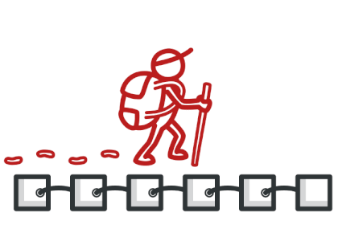

# Iterator Design Pattern 

The Iterator pattern is a design pattern that allows sequential access to elements in a collection, without exposing its underlying representation. It provides a way to access the elements of an aggregate object sequentially without exposing the underlying details.

  

## Use Case: Iterating through Products in Different Categories

### Scenario
In an e-commerce platform like Amazon, products are categorized (e.g., Electronics, Clothing, Home Appliances). A user might browse products in a specific category or compare products across multiple categories. The platform might store products in various ways (arrays, databases, external APIs), and the user needs to browse them without worrying about their internal structure.

### Problem

The UI needs to allow users to easily browse products in different categories without exposing how the products are retrieved or stored (e.g., a local array, a remote API, or database queries).

## Use case  

* **Traversal of Complex Data Structures**: It is useful for traversing complex data structures (like trees or graphs) where you want to abstract away the details of the data structure and focus on accessing the elements.

* **Uniform Access**: It provides a uniform way to access elements regardless of their internal structure. This is helpful when you have multiple types of collections and want to provide a consistent way to iterate over them.

* **Separation of Concerns**: By using an iterator, you separate the iteration logic from the collection itself. This allows changes to be made to the way elements are stored or accessed without affecting the iteration logic.

* **Multiple Iterators**: If you need multiple iterators to traverse the same collection independently, the Iterator pattern allows you to create separate iterators for the same collection without affecting the collection’s structure.

Read-Only Access: It can provide a way to access elements without allowing modification of the underlying collection, ensuring that the collection remains immutable during iteration.