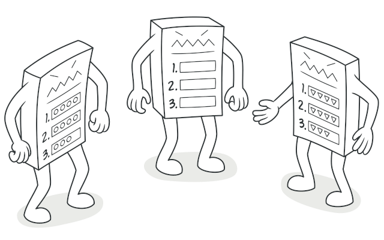

# Template Design Pattern 

The Template Method Pattern is a behavioral design pattern that defines the skeleton of an algorithm in a method, allowing subclasses to alter certain steps of the algorithm without changing its structure. This pattern helps in creating a method where the overall process remains the same, but some parts of it can be customized by subclasses.

  

## Key Concepts:
* **Template Method**: The base method in the parent class that defines the overall algorithm structure. It may call abstract or concrete methods, leaving certain steps to be implemented by subclasses.
* **Abstract/Concrete Methods**: Some of the steps in the algorithm are implemented in the base class (concrete methods), while others are left to be implemented in subclasses (abstract methods).
* **Subclass Customization**: Subclasses can override specific steps (methods) without modifying the template method itself.

## Advanatages Of Strategy Pattern
* **Code Reusability** : Avoids code duplication by pulling duplicate code into a superclass
* **Interface Seggregation And Dependency Inversion** : Client code needs to know only about the abstract class, not concrete classes
* **Encapsulation of Complexities** : Encapsulates complex parts of the code or algorithm, providing a simpler interface to the client
* **Control over Subclasses** : Controls subclasses by allowing them to add/alter parts of an algorithm, but not the whole thing or order of steps
* **Extensibility** : Makes the code more extensible, easy to support new variations by adding new subclasses

## Template VS Strategy 

### Template Method Pattern:
* Defines the skeleton of an algorithm in a base class and allows subclasses to redefine certain steps of the algorithm without changing its structure.
* Focuses on keeping the structure of the algorithm the same while letting subclasses implement specific steps.

### Strategy Pattern:
* Encapsulates interchangeable algorithms or behaviors within separate classes, and allows the client to choose which one to use at runtime.
* Focuses on allowing clients to swap between different algorithms (or strategies) dynamically.
