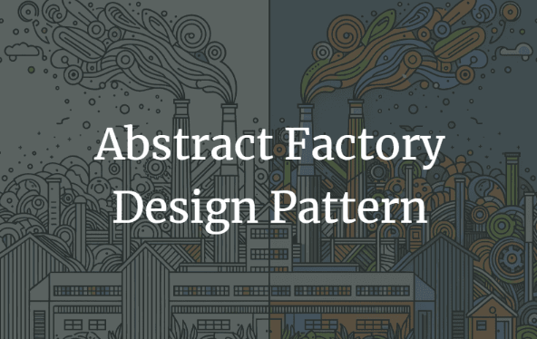

# Singleton Design Pattern

  

## Abstract Factory Design Pattern

Abstract Factory Pattern says that just define an interface or abstract class for creating families of related (or dependent) objects but without specifying their concrete sub-classes.That means Abstract Factory lets a class returns a factory of classes. So, this is the reason that Abstract Factory Pattern is one level higher than the Factory Pattern.

## Use Cases for the Abstract Factory Pattern:

* **Cross-Platform Applications:** When an application needs to support multiple platforms, like different operating systems, the Abstract Factory can create platform-specific objects without modifying the core application code.

* **Families of Related Products:** When an application must handle families of related products, such as different kinds of UI components (buttons, textboxes) for different themes or skins.

* **Product Variations:** When the system must be independent of how its objects are created and represented, and it must support different configurations.

## Real-World Analogy

Imagine you are in a car factory. You want to create parts for two different car models: a sedan and an SUV. You have different sets of parts for each model, like wheels, doors, and engines. The Abstract Factory Pattern would be like having a factory for each model type that knows how to create the specific parts needed for that model.