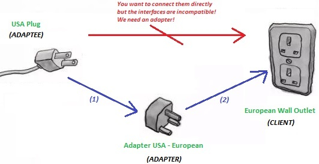

# Adapter Design Pattern 

  

The Adapter Design Pattern is a software design pattern that allows the interface of an existing class to be used from another interface. It's often used to make existing classes work with others without modifying their source code. The Adapter Pattern is especially useful when the classes that need to communicate with each other do not have compatible interfaces.      
  
## Simple Example 
Imagine you have a USB-C charger and a laptop with only a USB-A port. Without an adapter, you wouldn't be able to charge your laptop. However, a USB-C to USB-A adapter can bridge the gap, allowing you to connect the USB-C charger to the USB-A port on your laptop.

## Use Cases for the Adapter Pattern:

* **Legacy Code Integration:** When integrating old, legacy code with new code, the Adapter pattern allows you to create a wrapper that makes the old code compatible with the new system without modifying the existing code.

* **Third-Party Library Integration:** When using a third-party library or API that doesn't match the interface your application requires, you can use an Adapter to convert the interface provided by the library to the one your application expects.

* **Different Interface Requirements:** When different parts of an application expect different interfaces, the Adapter pattern can unify these differences by providing a common interface.

* **Reusability of Code:** By adapting one interface to another, you can reuse existing code without altering it, which promotes code reusability and reduces redundancy.

* **Simplification:** When you want to simplify a complex interface, the Adapter pattern can provide a simpler interface for the client to interact with, hiding the complexity of the underlying systems.