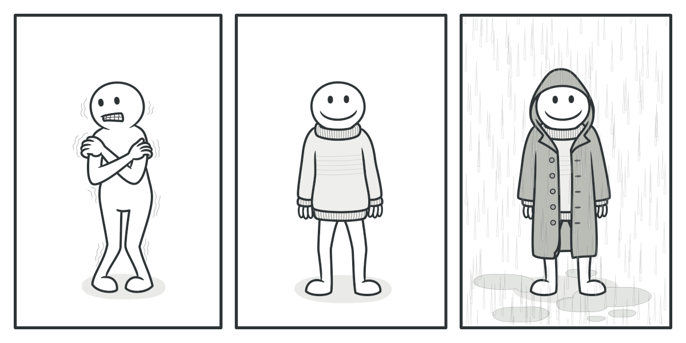

# Decorator Design Pattern 

The Decorator design pattern is a structural design pattern that allows you to dynamically ``add or override behaviour`` in an existing object without changing its implementation. This pattern is particularly useful when you want to modify the behavior of an object without affecting other objects of the same class.     

Use the Decorator pattern when you need to be able to assign extra behaviors to objects at runtime without breaking the code that uses these objects.

### Key Concepts:

* **Component:** The interface or abstract class that defines the basic behavior that can be dynamically added to.

* **Concrete Component:** The class that implements the Component interface and represents the original object.

* **Decorator:** An abstract class that implements the Component interface and contains a reference to a Component object. It delegates the behavior to the Component object and can add additional behavior.

* **Concrete Decorators:** These classes extend the Decorator class to add specific behaviors.

## Example 

Wearing clothes is an example of using decorators. When you’re cold, you wrap yourself in a sweater. If you’re still cold with a sweater, you can wear a jacket on top. If it’s raining, you can put on a raincoat. All of these garments “extend” your basic behavior but aren’t part of you, and you can easily take off any piece of clothing whenever you don’t need it.

  

## Advantage Of Decorator Pattern 

* extend an object’s behavior without making a new subclass
* add or remove responsibilities from an object at runtime.
* combine several behaviors by wrapping an object into multiple decorators.
* divide a monolithic class that implements many possible variants of behavior into several smaller classes.

# Decorator Pattern  UseCase 

The Decorator design pattern is useful for adding functionality to objects in a flexible and reusable way without altering their structure. Here are some common use cases:

*    Dynamic Behavior: When you need to add or change an object's behavior dynamically at runtime. For example, you might want to add logging, security, or other cross-cutting concerns to objects without modifying their core functionality.
*    Enhancing Functionality: When you want to enhance or extend the behavior of objects in a modular way. For instance, you might have a base class for a window and use decorators to add features like scrolling, borders, or scrollbars.

*   Open/Closed Principle: When you want to adhere to the Open/Closed Principle, which states that software entities should be open for extension but closed for modification. Decorators allow you to extend functionality without changing existing code.

*   Avoiding Subclass Explosion: When you need to create a large number of subclasses to add different combinations of functionality. Decorators let you combine different behaviors dynamically rather than creating many subclasses.

*    Composition over Inheritance: When you prefer to use composition rather than inheritance to extend behavior. Decorators can be combined to achieve different configurations of functionality, making the system more flexible and easier to manage.

For example, in a graphical user interface (GUI) system, you might have a basic Window class. You can use decorators to add functionalities such as borders, scrollbars, or even add a title bar, without changing the core Window class itself.
