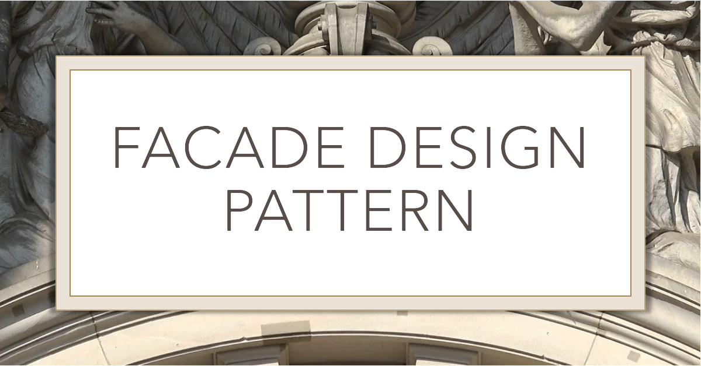

# Facade Design Pattern

  

The Facade Design Pattern is a structural pattern used to simplify the interface to a complex system. It provides a unified interface to a set of interfaces in a subsystem, making it easier for clients to interact with the subsystem without needing to understand its complexities.

## Simple Explanation

Imagine you have a home theater system with multiple components: a DVD player, an amplifier, and a projector. Each component has its own set of controls and settings. Using all of these controls can be complex and cumbersome for users.

The Facade Pattern helps by creating a single, simplified interface (a facade) that wraps around these components. With the facade, users can perform complex operations (like watching a movie) with just a single method call, hiding the complexity of interacting with each individual component.

## Benefits of Using the Facade Pattern

* **Ease of Use:** Simplifies the interaction with complex systems by providing a unified interface.
* **Decoupling:** Reduces dependencies between the client code and the complex subsystems, promoting modularity.
* **Maintainability:** Makes the system easier to maintain and extend by isolating changes to the facade or subsystems.